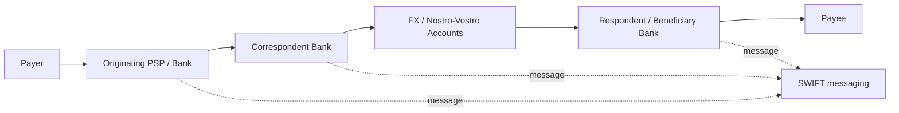

# Correspondent Banking Flow

```mermaid
flowchart LR
    Payer[Payer] --> PSP1[Originating PSP / Bank]
    PSP1 --> CorrBank[Correspondent Bank]
    CorrBank --> FX[FX / Nostro-Vostro Accounts]
    FX --> RespBank[Respondent / Beneficiary Bank]
    RespBank --> Payee[Payee]
    PSP1 -. message .-> SWIFT[SWIFT messaging]
    CorrBank -. message .-> SWIFT
    RespBank -. message .-> SWIFT
```
