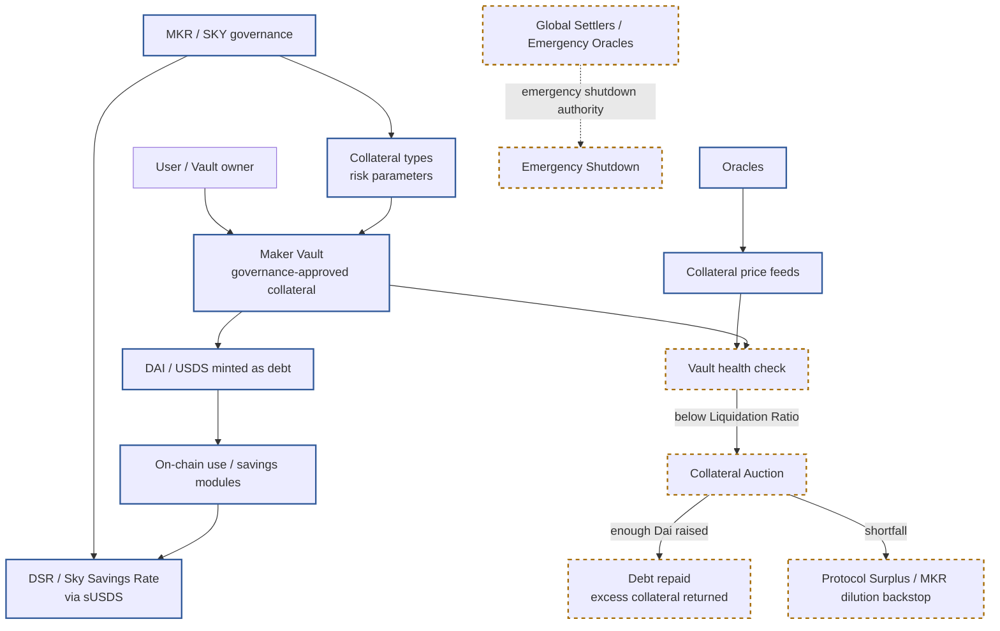

# DAI / USDS Protocol Flow

Updated 2026-05-25: added for the v0.3 clean slide script. This diagram keeps
DAI / USDS outside the fiat-backed payment-stablecoin issuer model and shows
the protocol-collateralised stability path supported by `CLAIM_098` to
`CLAIM_102`.

## Notes

- The diagram supports Slide 14 in `07_final_report/slide_script_v0_3.md`.
- It should not be read as a fiat-backed redemption flow. The user-facing
  stability mechanism is overcollateralisation, liquidation, governance risk
  parameters, and external actors, not direct issuer redemption.
- `CLAIM_102` covers the Sky rebrand layer: USDS, sUSDS, stUSDS, SKY, and
  the product-page USDC-to-USDS conversion route.

