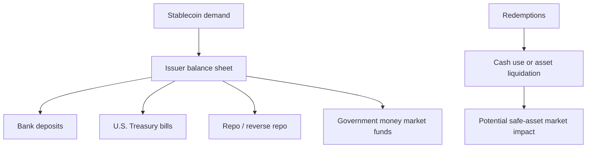

# Reserve Asset Flow

```mermaid
flowchart TD
    StablecoinDemand[Stablecoin demand] --> IssuerBalanceSheet[Issuer balance sheet]
    IssuerBalanceSheet --> BankDeposits[Bank deposits]
    IssuerBalanceSheet --> TBills[U.S. Treasury bills]
    IssuerBalanceSheet --> Repo[Repo / reverse repo]
    IssuerBalanceSheet --> MMF[Government money market funds]
    Redemptions[Redemptions] --> Liquidation[Cash use or asset liquidation]
    Liquidation --> MarketStress[Potential safe-asset market impact]
```
