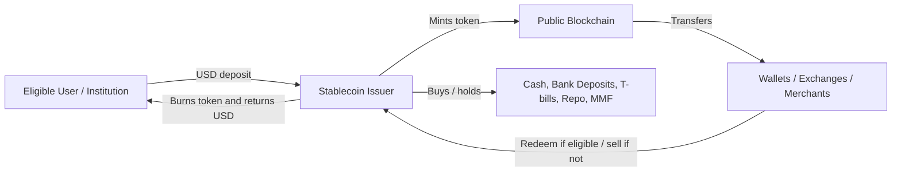

# Stablecoin Issuance and Redemption Flow

```mermaid
flowchart LR
    User[Eligible User / Institution] -->|USD deposit| Issuer[Stablecoin Issuer]
    Issuer -->|Mints token| Blockchain[Public Blockchain]
    Blockchain -->|Transfers| SecondaryUsers[Wallets / Exchanges / Merchants]
    Issuer -->|Buys / holds| Reserves[Cash, Bank Deposits, T-bills, Repo, MMF]
    SecondaryUsers -->|Redeem if eligible / sell if not| Issuer
    Issuer -->|Burns token and returns USD| User
```
