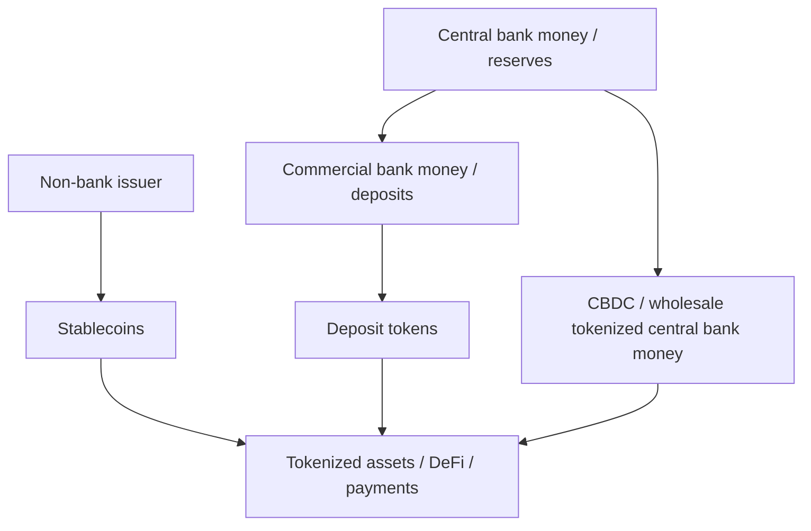

# Tokenized Money System Flow

```mermaid
flowchart TD
    CB[Central bank money / reserves] --> BankMoney[Commercial bank money / deposits]
    CB --> CBDC[CBDC / wholesale tokenized central bank money]
    BankMoney --> DepositTokens[Deposit tokens]
    NonBankIssuer[Non-bank issuer] --> Stablecoins[Stablecoins]
    Stablecoins --> TokenizedAssets[Tokenized assets / DeFi / payments]
    DepositTokens --> TokenizedAssets
    CBDC --> TokenizedAssets
```
