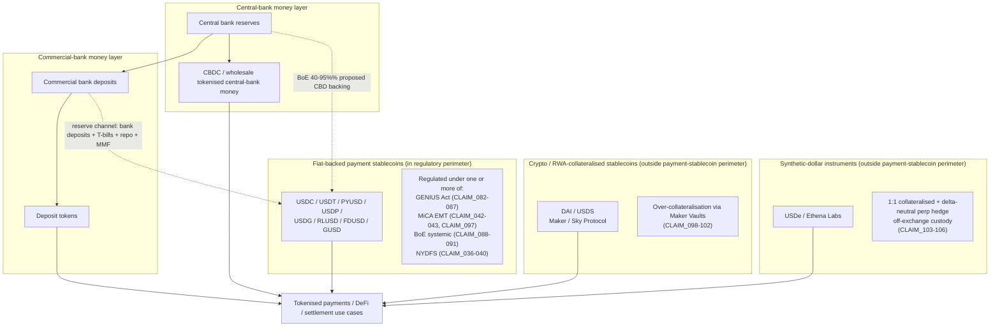

# Tokenized Money System Flow

Updated 2026-05-15 (v0.3): redrawn to reflect the three product categories
the report sustains throughout (chapter 1.3) and the regulatory perimeter
under GENIUS Act, MiCA, BoE, and NYDFS.

## Notes

- The diagram preserves the three product categories established in
  chapter 1.3. They share the on-chain transfer layer but enter the money
  system through different channels.
- Fiat-backed payment stablecoins are the only category fully inside the
  GENIUS Act / MiCA EMT / BoE systemic regime / NYDFS perimeter as written
  at the v0.3 cut-off.
- DAI / USDS and USDe are shown explicitly outside the payment-stablecoin
  perimeter. They remain subject to other applicable regimes (AML/CFT,
  securities, derivatives, consumer protection), which are not drawn here.
- BoE's proposed 40-95% central-bank-deposit backing channel is dashed to
  emphasise that it is a consultation rule, not yet enacted (`CLAIM_090`).
- The diagram does not attempt to scale the boxes by market size; supply
  and volume data should be sourced from chapter 7, not from this diagram.
