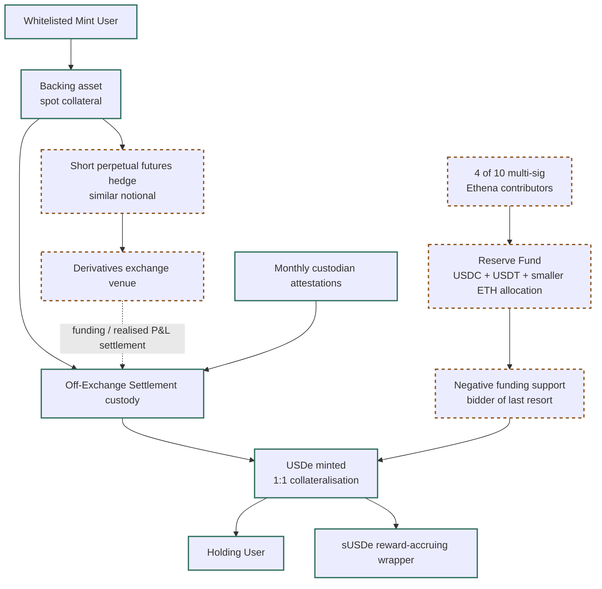

# USDe Synthetic-Dollar Flow

Updated 2026-05-25: added for the v0.3 clean slide script. This diagram shows
USDe as a synthetic-dollar structure rather than a fiat-backed payment
stablecoin. It is anchored to `CLAIM_103` to `CLAIM_106`.

## Notes

- The diagram supports Slide 15 in `07_final_report/slide_script_v0_3.md`.
- It separates USDe from sUSDe. USDe is the synthetic-dollar token; sUSDe is
  the reward-accruing wrapper.
- Off-Exchange Settlement custody mitigates exchange-specific counterparty
  risk but does not eliminate funding-rate, exchange-operational, custodian,
  or governance risk.

