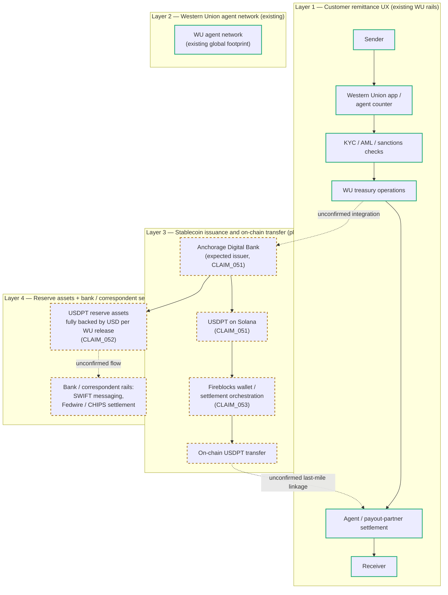

# USDPT Settlement Flow — Four-Layer Hypothesis Map

Updated 2026-05-15 (v0.3): redrawn as a four-layer swim-lane consistent with
chapter 6's "four layers must be kept separate" framing. The diagram is
explicitly a hypothesis map. Solid arrows are anchored to v0.3 evidence
(`CLAIM_051`, `CLAIM_052`, `CLAIM_053`). Dashed arrows are speculative
linkages that have **not** been confirmed by primary product documentation
and must not be claimed as documented architecture.

## Reading the diagram

- **Layer 1 (Customer remittance UX)** is Western Union's existing
  consumer-facing rail. It is independent of USDPT and exists today.
- **Layer 2 (Agent network)** is WU's existing global cash-in / cash-out
  footprint. The research does not assume WU agents handle retail USDPT
  cash-out without product documentation supporting that workflow.
- **Layer 3 (Stablecoin issuance + on-chain transfer)** is the planned
  USDPT product. Anchorage Digital Bank as expected issuer is supported
  by its OCC GENIUS Act comment letter (`CLAIM_051`); the Solana base
  chain is from the Western Union announcement; Fireblocks infrastructure
  involvement is from the Fireblocks press release (`CLAIM_053`).
- **Layer 4 (Reserve + bank settlement)** is the least documented layer.
  The Western Union release states USDPT will be "fully backed by U.S.
  dollars" (`CLAIM_052`), but a USDPT-specific reserve report, bank
  custodian, and the actual settlement integration with SWIFT / Fedwire /
  CHIPS / correspondent banking are not in the public record at v0.3.

## What the diagram deliberately does not claim

Per chapter 6 framing and the AGENTS.md non-negotiable rule:

- The diagram does **not** claim USDPT replaces SWIFT, correspondent
  banking, Fedwire, CHIPS, or Western Union's consumer-facing remittance
  rails. The dashed-line "unconfirmed linkage" arrows are exactly the
  edges that would need to be supported by primary workflow documentation
  before any replacement claim could be made.
- The diagram does **not** show direct customer redemption of USDPT to
  USD. Whether retail WU customers ever directly hold USDPT, or whether
  USDPT exists only at the inter-bank / inter-agent settlement layer, is
  itself an open question.
- The "reserve assets fully backed by USD" box reproduces the issuer
  release wording but does not commit the research to any specific
  reserve composition (T-bills, deposits, MMF shares, etc.); a
  USDPT-specific reserve report has not been published at v0.3.

## How to use this in slides

- This diagram supports Slide 38 (Four-layer separation) in the
  v0.3 slide outline.
- If a slide deck reuses this Mermaid as-is, the green / amber colour
  coding makes the "confirmed vs planned" distinction visually clear
  without needing a separate legend slide.
- If the slide deck redraws this in Keynote / PowerPoint shapes, keep the
  solid-vs-dashed-arrow convention and keep the four swim-lanes visually
  separate. Do not collapse Layer 1 and Layer 3 into a single arrow.
