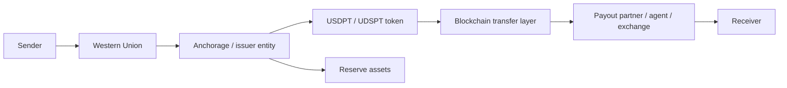

# USDPT / UDSPT Settlement Flow — Hypothesis Map

```mermaid
flowchart LR
    Sender[Sender] --> WU[Western Union]
    WU --> StablecoinIssuer[Anchorage / issuer entity]
    StablecoinIssuer --> Token[USDPT / UDSPT token]
    Token --> Blockchain[Blockchain transfer layer]
    Blockchain --> PayoutPartner[Payout partner / agent / exchange]
    PayoutPartner --> Receiver[Receiver]
    StablecoinIssuer --> Reserves[Reserve assets]
```

Note: This is a hypothesis map. Product-level documentation is still required before treating this as confirmed architecture.
