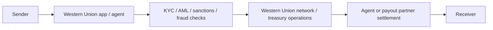

# Western Union Traditional Flow

```mermaid
flowchart LR
    Sender[Sender] --> WUFront[Western Union app / agent]
    WUFront --> Compliance[KYC / AML / sanctions / fraud checks]
    Compliance --> WUNetwork[Western Union network / treasury operations]
    WUNetwork --> AgentSettlement[Agent or payout partner settlement]
    AgentSettlement --> Receiver[Receiver]
```
